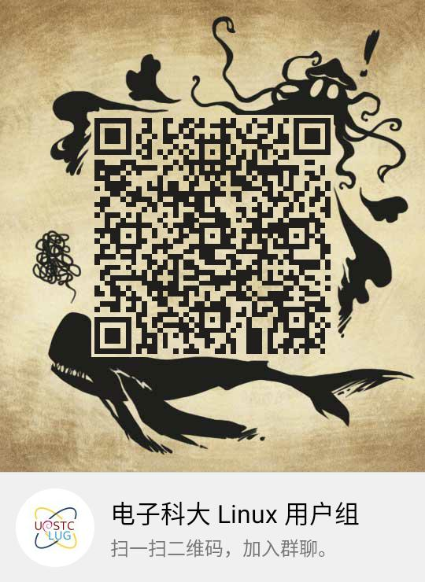
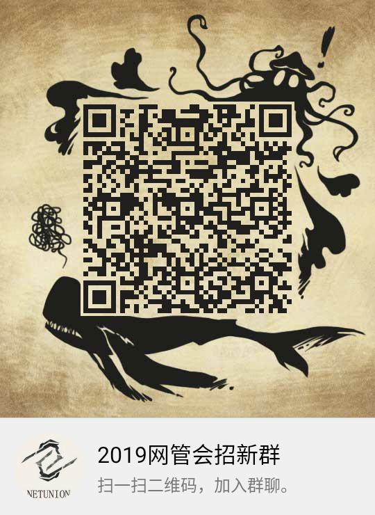

---
# 软件历史

---

## 概览
- 个人电脑的早期
- 商业软件的发展
- 自由软件运动
- 大公司拥抱开源软件

在计算机诞生的最初几十年，几乎所有软件都是由从事学术的研究人员写作开发的，并通常公有领域软件释出。由于软件需要经常性的进行修改，如：为了适配新的操作系统或硬件、修正错误及增加新功能，软件的源代码一般都会与软件一起提供。
60年代末，计算机变得小型化，个人计算机进入了人们的家中。一些富有的计算机爱好者得以在家中使用pc机。同时操作系统和编译器使得软件更丰富。一些人开始尝试出售软件。到了70年代末，商业公司几乎从计算机社群里挖走了所有的人开发商业软件。
1982年，UNIX不再提供源代码。次年RMS发起GNU计划，开始编写UNIX各组件的自由软件替代。后来又成立了FSF（自由软件基金会）来推广自由软件。
为了达成自由软件的目的，开放源代码是必要的手段。但很多开发者并不在乎自由软件，只是把开源当作一种编写程序的好方法。90年代末，一些人替换自由软件这个词，更多地强调开源软件，也以此吸引了很多商业公司的参与。微软就是一个典型的例子（虽然参与地很晚）。

---

## 个人电脑（PC）的诞生
1965 年，迪吉多公司发布了PDP-8，这被认为是个人电脑的先驱。

个人电脑开始在（有钱的）计算机爱好者家中流行起来。他们自己编写程序并互相分享

---

## ALtair、微软、家酿计算机俱乐部
--
### Altair 8800
1975年1月刊的《大众电子》(Popular Electronics)的首页上，Altair 8800 被介绍给读者。

Altair是一堆售卖495美元的零件，顾客需要自己去焊接组装。他的性能也比较弱，但由于相对当时的PC机足够小巧便宜和操作简易，Altair成为了历史上第一个流行的、取得商业成功的个人计算机。

--
### Microsoft
比尔盖茨和保罗艾伦看了那一期杂志后, 就开始研发这台机器的BASIC编译器，并成立了微软公司售卖售卖Altair BASIC。
--
### The Homebrew Computer Club
“你想搭建自己的计算机吗?抑或是终端机,电视机,打印机?如果是的话,来参加与你志趣相投的人们的聚会吧”——首次聚会的宣传
--
“这个俱乐部的主题,就是乐于奉献,帮助他人。我之所以设计Apple I,就是因为我想把它免费贡献给别人。”——沃兹

家酿计算机俱乐部(The Homebrew Computer Club)也于这一年成立。3月5日举办了第一次会议，传单上这样写到：“你想搭建自己的计算机吗?抑或是终端机,电视机,打印机?如果是的话,来参加与你志趣相投的人们的聚会吧”。之后的某次会议中，苹果创始人之一沃兹说道：“这个俱乐部的主题,就是乐于奉献,帮助他人。我之所以设计Apple I,就是因为我想把它免费贡献给别人。”（虽然他日后被乔布斯说服不再免费送出设计原理图）。从这两个例子可以看出，在早期的计算机世界还是互相分享为主。

--
### 1976 比尔盖茨的一封信
“请大多数业余爱好者们意识到,你们的软件都是偷来的。这公平吗?......你们这样做只会让别人不再愿意编写好的软件。谁能承受得起无偿进行专业的工作?......如果有谁愿意付钱的话,给我来信,我会很感激。”

某次活动中，Altair BASIC 被复制流传，比尔盖茨给俱乐部写了封著名的信

---

## UNIX 历史

在当时，硬件的规格还没有像现在一样统一，各类互补兼容的机器出现在市场上，每类机器的系统程序需要由对应的汇编语言单独编写。贝尔实验室的成员编写了PDP-7上的操作系统UnICS（汇编+B语言），被移植到PDP-11上的第二版时改名UNIX，为了解决效率问题汤普逊和里奇对其进行了改造，并于1971年共同发明了C语言，1973年完成了用C语言重写的第三版UNIX。在当时，为了实现最高效率，系统程序都是由汇编语言编写，所以湯普遜和里奇此举是极具大胆创新和革命意义的。用C语言编写的Unix代码简洁紧凑、易移植、易读、易修改，为此后Unix的发展奠定了坚实基础。
由于反垄断法的关系，垄断了美国长途电话业务的贝尔电话公司於1958年与司法部签订和解协议，同意不进入计算机业。所以在当时，UNIX作为实验室的业余产品被免费、提供源代码得提供给很多单位使用。其中加州大学伯克利分校为此添加了很多功能，发布为BSD。
1982年，AT&T败诉,将要被拆分为8家公司，就不再受到前述的限制。AT&T开始商业化UNIX，不再提供源代码。并对BSD开始诉讼。长达数年的UNIX版权纠纷开始了。

---
## 自由软件运动历史
--
## GNU 宣言
“GNU's Not Unix.”

之前的几个例子，都在表明计算机软件从爱好走向商业，也渐渐变得封闭。终于在1983年，一位名叫理查德·斯托曼的黑客无法忍受这种现状，他追求被称作自由软件的一类软件。自由软件意味着使用者有运行、复制、发布、研究、修改和改进该软件的自由。为了达到软件的自由，开放源代码是必须的。他开始了 GNU 计划来逐模块用自由软件替换 UNIX。并发起自由软件运动来推广他的理念，在法律上提供协助。其中著名的组件有 gcc、emacs。

---
## 自由软件（SFS定义）
--
- 自由之零：不论目的为何，有使用该软件的自由。
--
- 自由之一：有研究该软件如何运作的自由，并且得以修改该软件来符合使用者自身的需求。取得该软件之源码为达成此目的之前提。
--
- 自由之二：有重新散布该软件的自由，所以每个人都可以藉由散布自由软件来敦亲睦邻。
--
- 自由之三：有改善再利用该软件的自由，并且可以发表修訂後的版本供公众使用，如此一来，整个社群都可以受惠。如前项，取得该软件之源码为达成此目的之前提。

另一个常见的自由软件定义是 Debian 自由软件指导方针。

---

## Linux

在 90 年代初，UNIX 已成为昂贵的商用操作系统。GNU 项目的大部分组建已经完工，内核 Hurd 却一直没能完成。

---

## GNU/Linux

---

## 自由软件 & 开源软件
--
“自由软件”和“开源”基本上指的是同一范围的程序。然而，出于不同的价值观，它们对这些程序的看法大相径庭。自由软件运动为用户的计算自由而战斗；这是一个为自由和公正而战的运动。相反，开源理念重视的是实用优势而不是原则利害。——RMS
--
### Visual Studio Code
### Chrome
---
## 开源许可证
--

--
## GPL
--
## BSD
--
## MIT
--
## Apache
--
## WTFPL

---
## 开源软件 & 美国出口管理条例
--
- 软件出口必须申请许可。
--
- 除非该软件是公开可及的，那就不需要申请许可。
--
- 但公开可及的软件，若涉及信息加密技术仍然要申请许可。
--
- 除非该公开可及的软件，除了代码公开可及外，连加密技术本身也公开可及，那就再进入例外不需要申请许可。
--
- 虽然不需要申请许可，但这样的代码公开可及、加密技术公开可及的软件仍然要向美国 BIS 汇报备查，并提供相关讯息供其事前事后查验。

https://mp.weixin.qq.com/s/_wmBHskWi5CCTjDWu6fMAg

---
---
## One more thing

---
# 镜像站

---
# Dormforce

---

---
# freetalk

